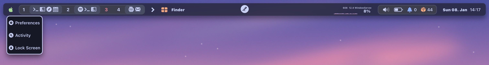
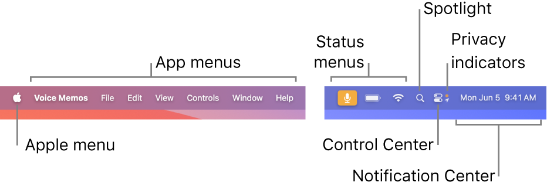

### Info

version: `0.1.2`

просто осталю это здесь, чтобы не потерять
[доки](https://aylur.github.io/ags-docs)

### TODO

- [ ] Стили
- [ ] Модули
    - [x] Workspaces
    - [x] Scratchpad
    - [x] Mode
    - [ ] Clock
        - [x] Clock itself
        - [ ] Calendar
    - [ ] Tray
    - [ ] runcat
    - [ ] touchpad
    - [x] language
    - [x] temperature
    - [x] cpu
    - [x] memory
    - [x] backlight
    - [x] pulse
    - [x] network
    - [x] battery
- [ ] Hover bug

    Странно фиксируются события hover и hoverlost

    При использовани `on_hover` и `on_hover_lost` ломается `:hover` в CSS. Будем менять концепт дизайна основывааясь на кликах и мб взаимодействии клавой вместо ховеров

- [ ] На старте необходимо запускать проверку на дурака
    - [ ] Существуют ли в системе скрипты запускаемые с `exec` или `execAsync`
- [ ] Парсить текущую гтк тему на предмет цветов и подобное (темная тема к примеру)

### референсы

-   [AGS](https://aylur.github.io/ags-docs/config/examples/)

    

-   [Sketchy](https://github.com/FelixKratz/SketchyBar)

    

    [примеры](https://github.com/FelixKratz/SketchyBar/discussions/47?sort=top)

-   [GNOME](https://youtu.be/KSQxPnKwNc8?si=rSi5Nm_bi2wuAYdO)
-   [macOS](https://support.apple.com/guide/mac-help/whats-in-the-menu-bar-mchlp1446/14.0/mac/14.0)

    
    [extras](https://bjango.com/articles/designingmenubarextras/)
    [menu-bar](https://developer.apple.com/design/human-interface-guidelines/the-menu-bar)
    [control-center](https://support.apple.com/guide/mac-help/quickly-change-settings-mchl50f94f8f/mac)

#### располложение

возьмем за основу скетчи с добавлением макоси

-   BAR

    ```
    |M|WWW|        |C|        |SM|CC|
    - M
        меню приложений
        открывается по клику либо сочитанию клавиш. Желательно по нажанию $mod
    - WWW
        рабочаие столы (см. ниже)
    - C
        время совмещенное с центром уведомлений
    - SM
        статус меню
    - CC
        control center
        разворачивающееся окно, с ползунками громкости, яркости
    ```

    -   WWW

        ```
        |W(w,w)|W(w)|W(w)|S(w)|

        - W
            название рабочего стола
        - S
            скретч (скрытый рабочий стол со свернутыми окнами)
        - w
            окно расположеженное на рабочем столе
        ```

    -   SM

        ```
        |T||B|N|

        - T
            трей со всяким говном (кнопка, которая разворачивает небольшое окно, в котором уже размещается сам трей, как на винде)
        - B
            АКБ
        - N
            сеть
        ```
